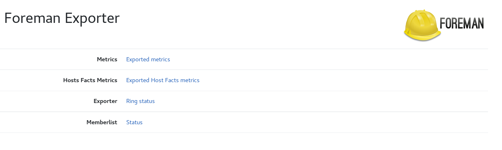
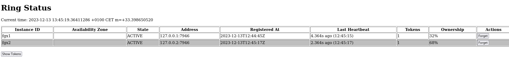
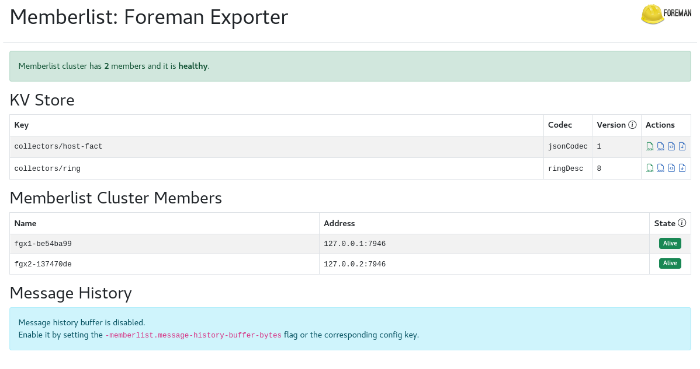

# foreman-exporter

## Foreman Prometheus Exporter

This [Prometheus](https://prometheus.io/)
[exporter](https://prometheus.io/docs/instrumenting/exporters/)
exposes [foreman](https://www.theforeman.org/) metrics.



### Usage

```
usage: foreman_exporter --url=URL --username=USERNAME --password=PASSWORD [<flags>]


Flags:
  -h, --[no-]help                Show context-sensitive help (also try --help-long and --help-man).
      --[no-]web.disable-exporter-metrics  
                                 Exclude metrics about the exporter itself (process_*, go_*).
      --web.telemetry-path="/metrics"  
                                 Path under which to expose metrics.
      --web.prefix-path=""       Prefix path for all http requests.
      --[no-]web.systemd-socket  Use systemd socket activation listeners instead of port listeners (Linux only).
      --web.listen-address=:11111 ...  
                                 Addresses on which to expose metrics and web interface. Repeatable for multiple addresses.
      --web.config.file=""       [EXPERIMENTAL] Path to configuration file that can enable TLS or authentication. See:
                                 https://github.com/prometheus/exporter-toolkit/blob/master/docs/web-configuration.md
      --url=URL                  Foreman url ($FOREMAN_URL)
      --username=USERNAME        Foreman username ($FOREMAN_USERNAME)
      --password=PASSWORD        Foreman password ($FOREMAN_PASSWORD)
      --concurrency=4            Max concurrent http request
      --limit=0                  Foreman host limit search
      --collector=host ...       collector to enabled (repeatable), choices: [host, hostfact]
      --collector.host.labels-include=COLLECTOR.HOST.LABELS-INCLUDE  
                                 host labels to include (regex)
      --collector.host.labels-exclude=COLLECTOR.HOST.LABELS-EXCLUDE  
                                 host labels to exclude (regex)
      --collector.hostfact.search=COLLECTOR.HOSTFACT.SEARCH  
                                 search host fact query filter
      --collector.hostfact.include=COLLECTOR.HOSTFACT.INCLUDE  
                                 host fact to include (regex)
      --collector.hostfact.exclude=COLLECTOR.HOSTFACT.EXCLUDE  
                                 host fact to exclude (regex)
      --[no-]cache.enabled       Enable cache
      --cache.ttl-expires=1h     Cache Expiration time
      --[no-]cache.compression   Enable zstd compression for kvstore values
      --[no-]ring.enabled        Enable the ring to deduplicate exported foreman metrics.
      --ring.instance-id=RING.INSTANCE-ID  
                                 Instance ID to register in the ring.
      --ring.instance-addr=RING.INSTANCE-ADDR  
                                 IP address to advertise in the ring. Default is auto-detected.
      --ring.instance-port=7946  Port to advertise in the ring.
      --ring.instance-interface-names=RING.INSTANCE-INTERFACE-NAMES  
                                 List of network interface names to look up when finding the instance IP address.
      --ring.join-members=RING.JOIN-MEMBERS  
                                 Other cluster members to join.
      --log.level=info           Only log messages with the given severity or above. One of: [debug, info, warn, error]
      --log.format=logfmt        Output format of log messages. One of: [logfmt, json]
      --[no-]version             Show application version.
```

### Metrics Exposed

**Foreman hosts status**

Enabled by default.

```
# HELP foreman_exporter_host_status_info Foreman host status
# TYPE foreman_exporter_host_status_info gauge
foreman_exporter_host_status_info{build_status="Installed",configuration_status="Active",global_status="OK",name="server.example.com",organization="example"} 1
```

**Foreman hosts facts**

Enable this collector with the flag `--collector=hostfact`.

Foreman hosts facts could render big metrics labels and must be used with the following flags to reduce the number of labels (labels cardinality):
- `--collector.hostfact.search=`: a foreman query to filter http facts response
- `--collector.hostfact.include=`: a regex to filter facts to include as labels
- `--collector.hostfact.exclude=`: a regex to filter facts to exclude as labels

As foreman host facts collector metrics could return many metrics (depending of foreman hosts number) and labels doesn't change a lot, a memory cache could be enabled.

```
# HELP foreman_exporter_host_facts_info Foreman host facts
# TYPE foreman_exporter_host_facts_info gauge
foreman_exporter_host_facts_info{fqdn="server.example.com", operatingsystem="RedHat",operatingsystemmajrelease="9",operatingsystemrelease="9.2"} 1
```

This collector return metrics to a dedicated endpoint `/hosts-facts-metrics`.

### HA with memberlist

This exporter could be run in cluster mode with memberlist.



To enable cluster mode, use the following flags:
```
      --ring.instance-id=RING.INSTANCE-ID  
                                 Instance ID to register in the ring.
      --ring.instance-addr=RING.INSTANCE-ADDR  
                                 IP address to advertise in the ring. Default is auto-detected.
      --ring.instance-port=7946  Port to advertise in the ring.
      --ring.instance-interface-names=RING.INSTANCE-INTERFACE-NAMES  
                                 List of network interface names to look up when finding the instance IP address.
      --ring.join-members=RING.JOIN-MEMBERS  
                                 Other cluster members to join.
```

One instance of the ring is elected to be the leader and this is the only one which will make request to foreman and export metrics.

If the leader instance goes down, another one will be elected and will start to export metrics.



With this config, it is easy to configure a prometheus agent to scrape the exporter metrics and avoid duplication.

If the foreman host facts collector metrics is enabled with the cache option, the cache is stored in the memberlist kvstore and replicated to all ring instances.

```
      --[no-]cache.enabled       Enable cache
      --cache.ttl-expires=1h     Cache Expiration time
      --[no-]cache.compression   Enable zstd compression for kvstore values
```

### TLS and basic authentication

Foreman Exporter supports TLS and basic authentication. This enables better control of the various HTTP endpoints.

To use TLS and/or basic authentication, you need to pass a configuration file using the `--web.config.file` parameter. The format of the file is described
[in the exporter-toolkit repository](https://github.com/prometheus/exporter-toolkit/blob/master/docs/web-configuration.md).

### Sources

- [Foreman api](https://apidocs.theforeman.org/foreman/2.4/apidoc/v2.html)
- [Hashicorp Memberlist](https://github.com/hashicorp/memberlist)
- [Grafana Distributed systems kit](https://github.com/grafana/dskit)
- [Grafana Mimir Override exporter](https://github.com/grafana/mimir/tree/main/pkg/util/validation/exporter)
