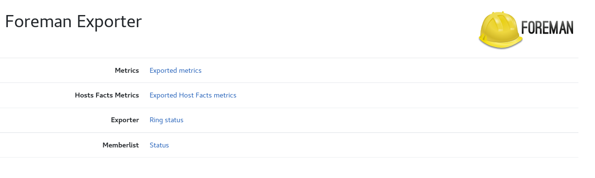
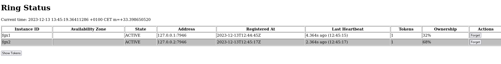
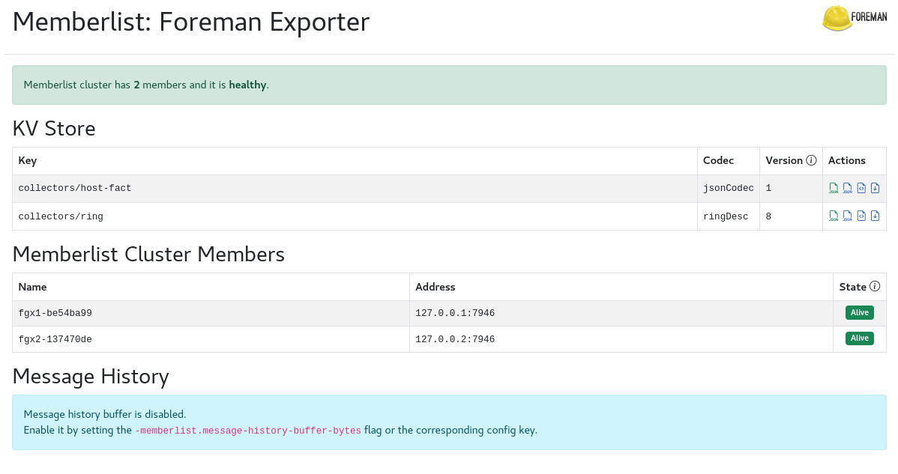

# foreman_exporter

## Foreman Prometheus Exporter

This [Prometheus](https://prometheus.io/)
[exporter](https://prometheus.io/docs/instrumenting/exporters/)
exposes [foreman](https://www.theforeman.org/) metrics.



### Usage

```
usage: foreman_exporter --url=URL --username=USERNAME --password=PASSWORD [<flags>]


Flags:
  -h, --[no-]help                Show context-sensitive help (also try --help-long and --help-man).
      --[no-]web.disable-exporter-metrics  
                                 Exclude metrics about the exporter itself (process_*, go_*).
      --web.telemetry-path="/metrics"  
                                 Path under which to expose metrics.
      --web.prefix-path=""       Prefix path for all http requests.
      --[no-]web.systemd-socket  Use systemd socket activation listeners instead of port listeners (Linux only).
      --web.listen-address=:11111 ...  
                                 Addresses on which to expose metrics and web interface. Repeatable for multiple addresses.
      --web.config.file=""       [EXPERIMENTAL] Path to configuration file that can enable TLS or authentication. See: https://github.com/prometheus/exporter-toolkit/blob/master/docs/web-configuration.md
      --url=URL                  Foreman url. ($FOREMAN_URL)
      --username=USERNAME        Foreman username. ($FOREMAN_USERNAME)
      --password=PASSWORD        Foreman password ($FOREMAN_PASSWORD)
      --[no-]skip-tls-verify     Foreman skip TLS verify. ($FOREMAN_SKIP_TLS_VERIFY)
      --concurrency=4            Max concurrent foreman client http request.
      --foreman.max-conns-per-host=0  
                                 Idle connections kept in the pool for the foreman host. Defaults to the concurrency (minimum 4).
      --retry-max=3              Max retries for foreman client http requests (honors the Retry-After header on rate-limit responses).
      --foreman.retry-max-wait=60s  
                                 Cap on the Retry-After delay honored on rate-limit responses (0 to honor it as-is).
      --foreman.rate-limit=0     Max foreman requests per second, retries included (0 to disable). Set it just under the server-side quota: a quota of N requests per minute is N/60 here.
      --foreman.rate-limit-burst=0  
                                 Token bucket depth for --foreman.rate-limit. Defaults to one second worth of requests.
      --limit=0                  Foreman client host limit search.
      --search=""                Foreman client host search filter.
      --timeout-offset=0.5s      Offset to subtract from Prometheus-supplied timeout.
      --[no-]collector.lock-concurrent-requests  
                                 Lock concurrent requests on collectors.
      --collector=host ...       Collector to enabled (repeatable), choices: [host, hostfact].
      --collector.host.labels-include=COLLECTOR.HOST.LABELS-INCLUDE  
                                 Host labels to include (regex).
      --collector.host.labels-exclude=COLLECTOR.HOST.LABELS-EXCLUDE  
                                 Host labels to exclude (regex).
      --collector.host.timeout=30s  
                                 Host default timeout if no request header 'X-Prometheus-Scrape-Timeout-Seconds'
      --[no-]collector.host.cache.enabled  
                                 Enable host cache, if global 'cache.enabled' is false.
      --[no-]collector.host.cache.compression  
                                 Enable host zstd cache compression for kvstore values, if global 'cache.compression' is false.
      --collector.host.cache.ttl-expires=COLLECTOR.HOST.CACHE.TTL-EXPIRES  
                                 Host cache expiration time, if omitted, inherit from 'cache.ttl-expires'.
      --collector.hostfact.search=COLLECTOR.HOSTFACT.SEARCH  
                                 Search host fact query filter.
      --collector.hostfact.include=COLLECTOR.HOSTFACT.INCLUDE  
                                 Host fact to include (regex).
      --collector.hostfact.exclude=COLLECTOR.HOSTFACT.EXCLUDE  
                                 Host fact to exclude (regex).
      --collector.hostfact.timeout=30s  
                                 Host fact default timeout if no request header 'X-Prometheus-Scrape-Timeout-Seconds'.
      --[no-]collector.hostfact.cache.enabled  
                                 Enable host fact cache, if global 'cache.enabled' is false.
      --[no-]collector.hostfact.cache.compression  
                                 Enable host fact zstd cache compression for kvstore values, if global 'cache.compression' is false.
      --collector.hostfact.cache.ttl-expires=COLLECTOR.HOSTFACT.CACHE.TTL-EXPIRES  
                                 Host fact cache expiration time, if omitted, inherit from global 'cache.ttl-expires'.
      --[no-]collector.hostfact.cache.update-on-partial  
                                 Update the host fact cache from a partial scrape (some hosts failed). Partial results are always exported; this only controls whether they are cached.
      --[no-]collector.hostfact.bulk  
                                 Collect host facts through /api/v2/fact_values, one request per batch of hosts, instead of one request per host. Enabled by default; use --no-collector.hostfact.bulk for the legacy per-host route. The other collector.hostfact.batch/per-page/max-pages/names/in-operator/max-url-length flags only apply in this mode.
      --collector.hostfact.batch-size=20  
                                 Host ids per fact_values request. Size it so batch x facts-per-host stays well under 'per-page': a response that fills a page is an order of magnitude slower.
      --collector.hostfact.per-page=10000  
                                 per_page for the fact_values requests.
      --collector.hostfact.max-pages=10  
                                 Max pages fetched for a single batch. A correctly sized batch fits in one page; hitting this limit means the facts are incomplete and is reported as an error.
      --collector.hostfact.names=COLLECTOR.HOSTFACT.NAMES ...  
                                 Exact fact names to select server-side (repeatable, or comma separated). Must be a superset of what 'collector.hostfact.include' keeps, otherwise facts are dropped before the regex ever sees them. Empty means no server-side name filter.
      --collector.hostfact.in-operator=^  
                                 scoped_search operator used to select host ids: '^' (in) or 'or'.
      --collector.hostfact.host-list-per-page=5000  
                                 per_page for the thin host list the fact collector walks before collecting. The list carries only ids and names, so what costs is the number of round trips, not the page size.
      --collector.hostfact.max-url-length=6000  
                                 Shrink a batch when its encoded search would exceed this many bytes.
      --[no-]cache.enabled       Enable cache for all collectors.
      --cache.ttl-expires=1h     Cache Expiration time for all collectors.
      --[no-]cache.compression   Enable zstd cache compression for all collectors in kvstore.
      --[no-]ring.enabled        Enable the ring to deduplicate exported foreman metrics.
      --ring.instance-id=RING.INSTANCE-ID  
                                 Instance ID to register in the ring.
      --ring.instance-addr=RING.INSTANCE-ADDR  
                                 IP address to advertise in the ring. Default is auto-detected.
      --ring.instance-port=7946  Port to advertise in the ring.
      --ring.instance-interface-names=RING.INSTANCE-INTERFACE-NAMES  
                                 List of network interface names to look up when finding the instance IP address.
      --ring.join-members=RING.JOIN-MEMBERS  
                                 Other cluster members to join.
      --log.level=info           Only log messages with the given severity or above. One of: [debug, info, warn, error]
      --log.format=logfmt        Output format of log messages. One of: [logfmt, json]
      --[no-]version             Show application version.
```

### Metrics Exposed

**Exporter metrics**

This endpoint return metrics about exporter itself and foreman client requests.

```
# HELP foreman_exporter_build_info A metric with a constant '1' value labeled by version, revision, branch, goversion from which foreman_exporter was built, and the goos and goarch for the build.
# TYPE foreman_exporter_build_info gauge
foreman_exporter_build_info{branch="feat/handle_scrape_timeout",goarch="amd64",goos="linux",goversion="go1.21.1",revision="7059cdd4062a29a53cc43225c23061c3b9750aac",tags="unknown",version="0.0.5-2-g7059cdd-dirty"} 1
# HELP foreman_exporter_client_in_flight_requests A gauge of all in-flight requests for the foreman client.
# TYPE foreman_exporter_client_in_flight_requests gauge
foreman_exporter_client_in_flight_requests 0
# HELP foreman_exporter_client_request_duration_seconds A histogram of all request latencies from the foreman client.
# TYPE foreman_exporter_client_request_duration_seconds histogram
foreman_exporter_client_request_duration_seconds_bucket{le="0.005"} 0
foreman_exporter_client_request_duration_seconds_bucket{le="0.01"} 0
foreman_exporter_client_request_duration_seconds_bucket{le="0.025"} 0
foreman_exporter_client_request_duration_seconds_bucket{le="0.05"} 0
foreman_exporter_client_request_duration_seconds_bucket{le="0.1"} 0
foreman_exporter_client_request_duration_seconds_bucket{le="0.25"} 14
foreman_exporter_client_request_duration_seconds_bucket{le="0.5"} 72
foreman_exporter_client_request_duration_seconds_bucket{le="1"} 73
foreman_exporter_client_request_duration_seconds_bucket{le="2.5"} 74
foreman_exporter_client_request_duration_seconds_bucket{le="5"} 74
foreman_exporter_client_request_duration_seconds_bucket{le="10"} 74
foreman_exporter_client_request_duration_seconds_bucket{le="+Inf"} 74
foreman_exporter_client_request_duration_seconds_sum 26.012748153
foreman_exporter_client_request_duration_seconds_count 74
# HELP foreman_exporter_client_requests_total A counter for all requests from the foreman client.
# TYPE foreman_exporter_client_requests_total counter
foreman_exporter_client_requests_total{code="200",method="get"} 74
# HELP foreman_exporter_client_retry_after_seconds A histogram of Retry-After delays honored from foreman rate-limit responses.
# TYPE foreman_exporter_client_retry_after_seconds histogram
foreman_exporter_client_retry_after_seconds_sum{status="429"} 4
foreman_exporter_client_retry_after_seconds_count{status="429"} 2
# HELP foreman_exporter_client_rate_limit_requests_per_second The client-side rate limit currently applied to foreman requests, 0 when disabled.
# TYPE foreman_exporter_client_rate_limit_requests_per_second gauge
foreman_exporter_client_rate_limit_requests_per_second 16
# HELP foreman_exporter_client_rate_limit_delayed_requests_total A counter of foreman client requests that were held back by the client-side rate limiter.
# TYPE foreman_exporter_client_rate_limit_delayed_requests_total counter
foreman_exporter_client_rate_limit_delayed_requests_total 7861
# HELP foreman_exporter_client_rate_limit_wait_seconds_total Cumulative time foreman client requests spent waiting on the client-side rate limiter.
# TYPE foreman_exporter_client_rate_limit_wait_seconds_total counter
foreman_exporter_client_rate_limit_wait_seconds_total 18952.3
# HELP foreman_exporter_client_fact_values_requests_total A counter for /api/v2/fact_values requests from the foreman client.
# TYPE foreman_exporter_client_fact_values_requests_total counter
foreman_exporter_client_fact_values_requests_total{status="success"} 421
```

In bulk mode (see below) the host fact collector also reports how the batching
went. The two that indicate degraded data are `..._batches_failed_total` and
`..._batches_maxpages_total`; the others are there to size the batches.

```
# TYPE foreman_exporter_host_facts_batches_total counter
foreman_exporter_host_facts_batches_total 421
# TYPE foreman_exporter_host_facts_batches_failed_total counter
foreman_exporter_host_facts_batches_failed_total 0
# TYPE foreman_exporter_host_facts_batches_maxpages_total counter
foreman_exporter_host_facts_batches_maxpages_total 0
# TYPE foreman_exporter_host_facts_hosts_lost_total counter
foreman_exporter_host_facts_hosts_lost_total 0
# TYPE foreman_exporter_host_facts_hosts_without_facts gauge
foreman_exporter_host_facts_hosts_without_facts 85
# TYPE foreman_exporter_host_facts_pages_continued_total counter
foreman_exporter_host_facts_pages_continued_total 0
# TYPE foreman_exporter_host_facts_per_page_clamped_total counter
foreman_exporter_host_facts_per_page_clamped_total 0
# TYPE foreman_exporter_host_facts_page_rows histogram
# TYPE foreman_exporter_host_facts_page_fill_ratio histogram
# TYPE foreman_exporter_host_facts_batch_hosts histogram
```

`..._batches_failed_total` and `..._batches_maxpages_total` are the two to alert
on, as a ratio over `..._batches_total`. `..._hosts_without_facts` is expected to
be non-zero — hosts that never reported, or whose facts do not match the search —
what matters is that it does not jump. `..._batch_hosts` catches a silent
collapse towards one host per batch, which would quietly undo the whole feature.

`--foreman.rate-limit` is expressed in requests per **second**, while server-side
quotas are usually stated per minute: a quota of 1000 requests per minute is
`--foreman.rate-limit=16`. It paces retries too, and the time spent waiting for a
token is deliberately excluded from `foreman_exporter_client_request_duration_seconds`
and from `foreman_exporter_client_in_flight_requests`, so those two keep measuring
foreman rather than the exporter's own throttling.

**Foreman hosts status**

Enabled by default.

This collector return metrics to a dedicated endpoint `/host-metrics`.

```
# HELP foreman_exporter_host_status_info Foreman host status
# TYPE foreman_exporter_host_status_info gauge
foreman_exporter_host_status_info{build_status="Installed",configuration_status="Active",global_status="OK",name="server.example.com",organization="example"} 1
```

If the memory cache is enabled and the cache has expired it is possible to use it even if foreman api is not available (network outage, service restart, slow response...). This could prevent hole in metrics scrapping and alerts flapping. To use it, just pass the uri param `expired-cache=true` in scrape config or curl cmd.

```
curl http://localhost:11111/host-metrics?expired-cache=true
```

If the memory cache is enabled, it is possible to force cache regeneration with the param `cache=false`.

```
curl http://localhost:11111/host-metrics?cache=false
```

The following metrics have been added:
```
# HELP foreman_exporter_host_scrape_timeout 1 if timeout occurs, 0 otherwise
# TYPE foreman_exporter_host_scrape_timeout gauge
foreman_exporter_host_scrape_timeout 1
# HELP foreman_exporter_host_use_expired_cache 1 if using expired cache, 0 otherwise
# TYPE foreman_exporter_host_use_expired_cache gauge
foreman_exporter_host_use_expired_cache 1
```

**Foreman hosts facts**

Enable this collector with the flag `--collector=hostfact`.

This collector return metrics to a dedicated endpoint `/host-facts-metrics`.

Foreman hosts facts could render big metrics labels and must be used with the following flags to reduce the number of labels (labels cardinality):
- `--collector.hostfact.search=`: a foreman query to filter http facts response
- `--collector.hostfact.include=`: a regex to filter facts to include as labels
- `--collector.hostfact.exclude=`: a regex to filter facts to exclude as labels

As foreman host facts collector metrics could return many metrics (depending of foreman hosts number) and labels doesn't change a lot, a memory cache could be enabled.

```
# HELP foreman_exporter_host_facts_info Foreman host facts
# TYPE foreman_exporter_host_facts_info gauge
foreman_exporter_host_facts_info{name="server.example.com", operatingsystem="RedHat",operatingsystemmajrelease="9",operatingsystemrelease="9.2"} 1
```

If the memory cache is enabled and the cache has expired it is possible to use it even if foreman api is not available (network outage, service restart, slow response...). This could prevent hole in metrics scrapping and alerts flapping. To use it, just pass the uri param `expired-cache=true` in scrape config or curl cmd.

```
curl http://localhost:11111/host-facts-metrics?expired-cache=true
```

If the memory cache is enabled, it is possible to force cache regeneration with the param `cache=false`.

```
curl http://localhost:11111/host-facts-metrics?cache=false
```


The following metrics have been added:
```
# HELP foreman_exporter_host_facts_scrape_timeout 1 if timeout occurs, 0 otherwise
# TYPE foreman_exporter_host_facts_scrape_timeout gauge
foreman_exporter_host_facts_scrape_timeout 1
# HELP foreman_exporter_host_facts_use_expired_cache 1 if using expired cache, 0 otherwise
# TYPE foreman_exporter_host_facts_use_expired_cache gauge
foreman_exporter_host_facts_use_expired_cache 1
```

#### Host fact collection: the two modes

`/api/v2/hosts/:id/facts` and `/api/v2/fact_values` are the same controller action
in foreman: the per-host route only appends `host = <id>` to the search. Asking
for one host per request is therefore a choice, not a constraint, and on a fleet
of a few thousand hosts it is the dominant cost of the collector.

Both modes return the same facts and both apply
`--collector.hostfact.include` / `--collector.hostfact.exclude` to decide the
exported labels. What differs is the request count, and with it *which knob
matters*:

| | per-host (`--no-collector.hostfact.bulk`) | bulk (default) |
|---|---|---|
| requests per pass | one per host, plus the host list | one per batch of `batch-size` hosts |
| what bounds a pass | `concurrency / latency` | the request count, then per-request cost |
| `--concurrency` | **the only lever**: throughput is exactly `concurrency / latency`, so a slow foreman is paid for on every host | much less sensitive, but still real: at the default batch size a few thousand hosts is a few hundred requests, so leaving `--concurrency` at 4 still costs many waves |
| `--foreman.rate-limit` | usually the binding constraint — thousands of requests against a per-minute quota sets a hard floor on the pass | rarely reached |
| response size | one host's facts | `batch-size x facts-per-host` rows, see the sizing rules below |
| cost of one failure | one host missing | one batch missing |
| cost of a retry | a full pass | a full pass, but a pass is now short |

A collector pass is two phases: fetching the thin host list, then collecting the
facts. Only the second is predictable, so they are timed separately -
`foreman_exporter_host_facts_host_list_duration_seconds` against the collector's
total. Timing them together makes a slow list look like slow facts, which sends
you tuning batch sizes for a problem that is not there. The list pages are
fetched in parallel and sized by `--collector.hostfact.host-list-per-page`; since
they carry only ids and names, what costs is the number of round trips, not the
page size.

Two consequences worth planning for.

In **per-host** mode the pass duration is dominated by foreman's per-request
latency, which is outside your control: raising `--concurrency` is the only
response, and it pushes back on a server that is already slow. This is the mode
to keep if you need the search sent to foreman to stay byte-for-byte what it is
today.

In **bulk** mode a failure costs a whole batch instead of a single host, so the
blast radius is larger — but the pass is short enough that not caching a partial
result and letting the next scrape retry becomes the cheap option rather than an
hour of stale cache. Keep `--collector.hostfact.cache.update-on-partial` off, and
consider `--collector.lock-concurrent-requests` so two passes cannot overlap
while the cache is expired.

With `--collector.hostfact.bulk` the collector asks for a batch of host ids at a
time:

```
GET /api/v2/fact_values?page=1&per_page=10000
    &search=(<hostfact.search>) and host_id ^ (id1, id2, ... idN)
```

Three things decide the batch size, and the first one is not obvious:

- **The defaults assume roughly 250 facts per host.** `batch-size=20` against
  `per-page=10000` leaves a comfortable margin there; a fleet reporting 500 facts
  per host would fill every page and pay the expensive path on every batch.
  Measure yours and size accordingly — `foreman_exporter_host_facts_page_fill_ratio`
  shows how close you are without needing to know the configured `per-page`.
- **Rows, not hosts, drive the cost.** A request stays cheap as long as it brings
  back a few thousand fact rows, and gets an order of magnitude slower once the
  response fills a page. Keep `batch-size x facts-per-host` well under
  `per-page`; raising `per-page` to fit a bigger batch trades a cheap request
  for an expensive one.
- **A full page means the result was cut.** The collector then fetches the next
  page and merges it, so nothing is lost — but it pays the expensive path, and
  `foreman_exporter_host_facts_pages_continued_total` counts it. Beyond
  `--collector.hostfact.max-pages` it gives up: that batch is reported as an
  error and **none of its hosts are exported**, because pagination cuts on fact
  rows and its hosts may be missing some. Facts are const labels, so a shorter
  label set is a *different* series rather than a smaller one — dropping the
  batch for one pass is recoverable, silently replacing series is not.
  `foreman_exporter_host_facts_batches_maxpages_total` counts that case, and it
  is the one to alert on.
- **The search must fit in the request line.** Batches are shrunk automatically
  to stay under `--collector.hostfact.max-url-length`.

`--collector.hostfact.in-operator` selects how the host ids are written into the
search. `^` is scoped_search's *in* operator and is what you want:

```
^     host_id ^ (101, 102, 103)                              -> host_id IN (...)
or    (host_id = 101 or host_id = 102 or host_id = 103)
```

The `or` fallback exists because `^` belongs to foreman's search layer rather
than to its documented API surface, so nothing promises it across versions. It
produces the same result but is two to three times longer once encoded — for
six-digit host ids, a batch of 250 encodes to roughly 2.9 KB with `^` against
7.4 KB with `or`, against a request line usually capped at 8 KB. Batches are
shrunk automatically to stay under `--collector.hostfact.max-url-length`, so the
fallback costs more requests rather than breaking.

Only switch if the server rejects the operator — a `400` with a message about an
unrecognised field or a parse error. There is no other reason to prefer `or`.

`--collector.hostfact.names` pushes the fact-name selection to the server instead
of downloading every fact and discarding most of them client-side. It cuts both
the response size and the request cost, but it composes with
`--collector.hostfact.include` as an **intersection**: a fact absent from the
server-side list never reaches the regex. Keep the list a superset of what the
regex keeps, or leave it empty.

`--collector.hostfact.include` and `--collector.hostfact.exclude` still define the
exported label set in both modes; the server-side filter is only an optimisation.

#### Partial results

A collector scrape can fail for some hosts and succeed for the rest: a few hosts
rate-limited by foreman, or one page of the host list that did not come back.
**Those partial results are exported**, rather than the whole scrape being
discarded because of a single failure.

Two consequences for anything alerting on these collectors:

- `foreman_exporter_host_scrape_error` and `foreman_exporter_host_facts_scrape_error`
  going to `1` no longer implies that the series disappeared. They mean *some*
  hosts are missing, not *all*. Alert on the series count too if you need to
  catch a total outage.
- In bulk mode a whole batch is missing rather than a single host, so the blast
  radius of one failure is larger. A batch is never exported half-collected
  though: a failed or truncated batch drops all of its hosts rather than export
  them with an amputated set of facts, which would silently create a different
  series for each. `foreman_exporter_host_facts_hosts_lost_total` counts the
  hosts this costs, and it is not reconstructable from the batch counters since
  batches are shrunk to fit the request line.
- The host list is paginated on the `subtotal` foreman reports for the search,
  so a short read is detected: collecting fewer hosts than announced also raises
  `foreman_exporter_host_scrape_error`, and the hosts that were collected are
  still exported.

The cache is deliberately more conservative than the exported metrics. The host
collector never caches an incomplete list, and the host fact collector only
caches a partial scrape when `--collector.hostfact.cache.update-on-partial` is
set — otherwise a single bad run would degrade the cache for a whole TTL.

```
# HELP foreman_exporter_host_facts_scrape_error 1 if there was an error, 0 otherwise
# TYPE foreman_exporter_host_facts_scrape_error gauge
foreman_exporter_host_facts_scrape_error 0
# HELP foreman_exporter_host_facts_scrape_duration_seconds Duration of the last completed host facts collector scrape of foreman.
# TYPE foreman_exporter_host_facts_scrape_duration_seconds gauge
foreman_exporter_host_facts_scrape_duration_seconds 527.4
```

`*_scrape_duration_seconds` is updated on every outcome, including a scrape that
was slow *and* failed, which is usually the one worth measuring.

### HA with memberlist

This exporter could be run in cluster mode with memberlist.



To enable cluster mode, use the following flags:
```
      --ring.instance-id=RING.INSTANCE-ID  
                                 Instance ID to register in the ring.
      --ring.instance-addr=RING.INSTANCE-ADDR  
                                 IP address to advertise in the ring. Default is auto-detected.
      --ring.instance-port=7946  Port to advertise in the ring.
      --ring.instance-interface-names=RING.INSTANCE-INTERFACE-NAMES  
                                 List of network interface names to look up when finding the instance IP address.
      --ring.join-members=RING.JOIN-MEMBERS  
                                 Other cluster members to join.
```

One instance of the ring is elected to be the leader and this is the only one which will make request to foreman and export metrics.

If the leader instance goes down, another one will be elected and will start to export metrics.

Each instance exposes the role it currently holds, resolved at scrape time:

```
# HELP foreman_exporter_node_role Node role, 0 = unknown, 1 = leader, 2 = follower
# TYPE foreman_exporter_node_role gauge
foreman_exporter_node_role 1
```

A ring that cannot be resolved reports `0` (and increments
`foreman_exporter_ring_leader_lookup_errors_total`) rather than defaulting to
follower, so a cluster left without a leader is visible. `count(foreman_exporter_node_role == 1)`
alerts on `0` (no leader) and on `> 1` (split ring).



With this config, it is easy to configure a prometheus agent to scrape the exporter metrics and avoid duplication.

If the foreman host facts collector metrics is enabled with the cache option, the cache is stored in the memberlist kvstore and replicated to all ring instances.

```
      --[no-]cache.enabled       Enable cache
      --cache.ttl-expires=1h     Cache Expiration time
      --[no-]cache.compression   Enable zstd compression for kvstore values
```

### TLS and basic authentication

Foreman Exporter supports TLS and basic authentication. This enables better control of the various HTTP endpoints.

To use TLS and/or basic authentication, you need to pass a configuration file using the `--web.config.file` parameter. The format of the file is described
[in the exporter-toolkit repository](https://github.com/prometheus/exporter-toolkit/blob/master/docs/web-configuration.md).

### Sources

- [Foreman api](https://apidocs.theforeman.org/foreman/2.4/apidoc/v2.html)
- [Hashicorp Memberlist](https://github.com/hashicorp/memberlist)
- [Grafana Distributed systems kit](https://github.com/grafana/dskit)
- [Grafana Mimir Override exporter](https://github.com/grafana/mimir/tree/main/pkg/util/validation/exporter)
